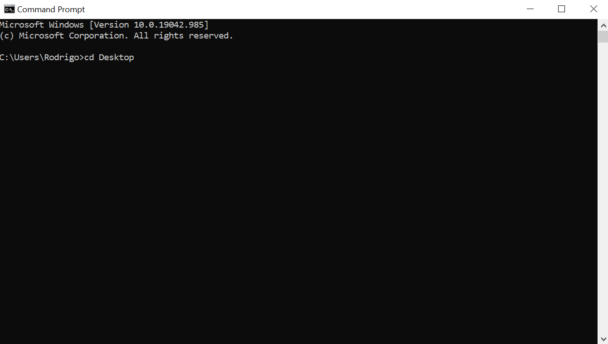

<iframe src="https://www.youtube.com/watch?v=lCfw87C-sNw&t=13s"></iframe

<h1>Pasos a seguir para correr la app a nivel local</h1>

<h2>Requisitos:</h2>
	*) Tener instalado NodeJS  
	*) Saber acceder a una consola/linea de comandos (cmd-powershell-gitbash) 
   
   

<h2>Instrucciones:</h2>
  <h3>1) Abrir la linea de comandos/consola (cmd-powershell-gitbash)</h3>
   
    

     

  <h3>2) Ingresar al escritorio (cd desktop) y presionar ENTER </h3>
   
    

     

  <h3> 3) Crear una carpeta mediante el comando <strong>mkdir</strong></h3>
     
    

     
  <h3> 4) Acceder a la carpeta creada arriba mediante el comando <strong>cd</strong> </h3>
     
    

     

<h3>5)Clonar el repositorio (copiar textual "git clone https://github.com/rodrigovelazco7997/Countries-Basic-App.git")</h3>
     
    

     

    
<h3>6)Ingresar al repositorio (copiar textual "cd Countries-Basic-App")</h3>
     
    

     

<h3>7)Ingresar a la carpeta del back-end e instalar las dependencias ("cd api --> npm install")</h3>
     
    

     

<h3>8)Crear dentro de la carpeta api un archivo con el nombre ".env" que tenga:
    <h4>
    DB_USER=postgres  
    DB_PASSWORD=rodri7997jaja  
    DB_HOST=localhost
    </h4></h3>
     
    

     
    

     

<h3>9)Iniciar el back-end (comando "npm start")</h3>
     
    

     
  
  <h3>Luego de que haya iniciado correctamente el back-end, abrir otra linea de comando para el front-end</h3>
   

<h3>10)Ingresar a la carpeta client </h3>
     
    

     
  
<h3>10)Instalar las dependencias (npm install) </h3>
     
    

     

<h3>10)Iniciar el front-end (npm start) </h3>
     
    

     

